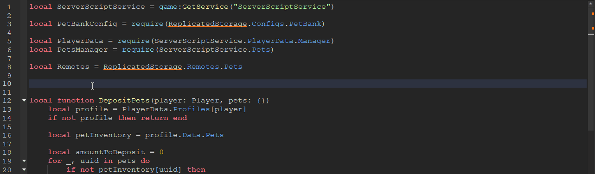

<h1 align="center">Roblox Auto Import</h1>

    

Roblox Auto Import is a powerful plugin designed to enhance your scripting experience in Roblox Studio. With automatic importing of **Services** & **Modules**, your development workflow becomes faster and smoother. Say goodbye to manual work and take advantage of the numerous features to make scripting a breeze!

    

## 🎉 Features
* **Automatic Imports**: Just type the name, and the required Services & Module Scripts are imported.
* **Context-Specific Suggestions**: Suggestions are tailored to the context of the current script (Server/Client/Shared accessible).
* **Flexible Filtering**: Easily filter module and service import suggestions by various criteria like ancestors, ancestor types, modules, and services.

## 💾 Installation

### Roblox Marketplace
Installing the plugin is a breeze through the [Roblox Marketplace](https://create.roblox.com/marketplace/asset/14443707366/Auto-Import), and the best part is, it's **free**!

There is also a paid version (100 Robux), which is literally the exact same thing, but enables anyone who wants to support me using Robux. It can be found [here](https://www.roblox.com/library/14457646433/Auto-Import)!

## 💬 Social

### 💸 Patreon
If you enjoy the plugin I've created, feel free to support me on [**Patreon**](https://www.patreon.com/MonzterDEV). You'll receive access to **Scripts**, **Games**, **Pet Packs**, **Gamepass Packs**, and many other resources you can use in your own projects!

### 📸 YouTube
Join me on [**YouTube**](https://www.youtube.com/@MonzterDEV) for the highest quality educational Roblox development content! Whether you're creating simulators or learning scripting fundamentals, there's something for everyone!

### 📲 Discord
Need some help? Have a suggestion? Want to give feedback? Feel free to join our [**Discord**](https://discord.gg/LearnRoblox)!

## 🚀 Coming Soon
* **Enhanced Comments**: Use comments to populate the import suggestion info window.
* **Smart Updating**: Renaming or moving a Module Script? All require statements will be updated, with notifications for any issues.
* **Code Samples**: Module import suggestions will include all public members (properties / methods) in the code sample.
* **Customizable Naming**: Tailor imported module variable names to your needs. Example: All modules required in the ServerScriptService can end with Manager. Or maybe even be able to add suffix to name from the parent they're stored in. (Module named Pets stored inside a Folder named Config would be imported as "PetsConfig")
* **Nested Module Properties**: Use a property inside nested module scripts to indicate which should be required instead of the first module

## 👷‍♂️ Building
1. Clone the repo and open in Visual Studio Code `git clone https://github.com/MonzterDev/Roblox-Auto-Import.git`
2. Install dependencies `npm i`
3. Start watch mode `rbxtsc -w`
4. Use rojo command to auto-build the plugin with into Studio's Plugins folder `rojo build -o C:\Users\X\AppData\Local\Roblox\Plugins\AutoImport.rbxm --watch`
5. Enable the `Reload plugins on file changed` setting inside Studio

You should now be able to easy work on the plugin.

## ❓ Frequently-Asked-Questions

### How do I use it?
Once you have the plugin installed and activated, you can open a script and begin typing out the name of the Module Script or Service you want to import. As you type, you'll begin to see different imports suggested. Hit enter on whatever import you want and a variable will be created for it towards the top of your script.

### Denied Script Injection Permission
If you get this error, it most likely means you declined the permission request when prompted after installing the plugin. You should be able to reopen the game and be prompted again.
